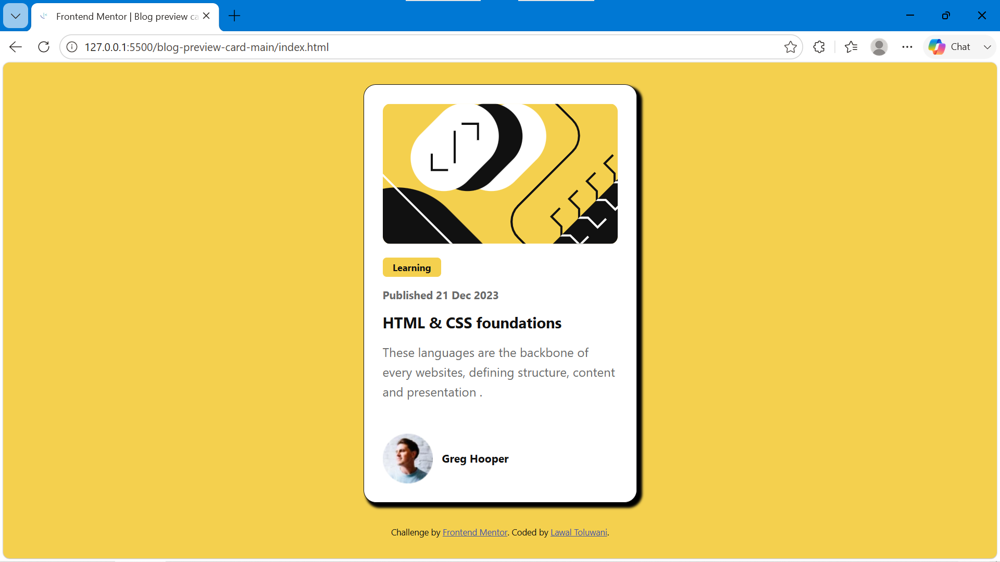

# Frontend Mentor - Blog preview card solution

This is a solution to the [Blog preview card challenge on Frontend Mentor](https://www.frontendmentor.io/challenges/blog-preview-card-ckPaj01IcS). Frontend Mentor challenges help you improve your coding skills by building realistic projects. 

## Table of contents

- [Overview](#overview)
  - [The challenge](#the-challenge)
  - [Screenshot](#screenshot)
  - [Links](#links)
- [My process](#my-process)
  - [Built with](#built-with)
  - [What I learned](#what-i-learned)
  - [Continued development](#continued-development)
  - [Useful resources](#useful-resources)
  - [AI Collaboration](#ai-collaboration)
- [Author](#author)
- [Acknowledgments](#acknowledgments)


## Overview

### The challenge

Users should be able to:

- See hover and focus states for all interactive elements on the page

### Screenshot



### Links

- Solution URL: (https://www.frontendmentor.io/solutions/blog-review-card-QqFuTxXjiO/report)
- Live Site URL: (https://blog-reviewcard.netlify.app/)

## My process

### Built with

- Semantic HTML5 markup
- CSS custom properties
- Flexbox
- CSS Grid
- Mobile-first workflow


### What I learned

Working through this challenge helped me practise centering a card both horizontally and vertically on the page using Flexbox. I also got more comfortable using CSS custom properties for colors so the yellow theme is easy to update in one place.


To see how you can add code snippets, see below:

```css
body {
  display: flex;
  justify-content: center;
  align-items: center;
  min-height: 100vh;
  background-color: var(--yellow);
}
```

### Continued development

I want to keep practising:

- Adding smooth hover/focus transitions on interactive elements
- Improving my understanding of CSS custom properties for theming
- Writing cleaner, more semantic HTML


## Author

- Frontend Mentor - [@LawalToluwani](https://www.frontendmentor.io/profile/LawalToluwani)
- Twitter - [@Kinshetesu](https://www.twitter.com/yourusername)
